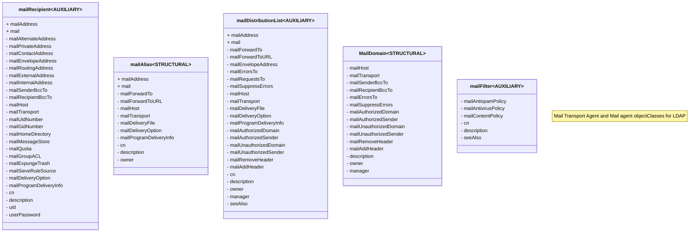

```mermaid
classDiagram
    note "Mail Transport Agent and Mail agent objectClasses for LDAP"

    class mailRecipient~AUXILIARY~ {
        + mailAddress
        + mail
        - mailAlternateAddress
        - mailPrivateAddress
        - mailContactAddress 
        - mailEnvelopeAddress
        - mailRoutingAddress 
        - mailExternalAddress
        - mailInternalAddress
        - mailSenderBccTo 
        - mailRecipientBccTo
        - mailHost
        - mailTransport
        - mailUidNumber
        - mailGidNumber 
        - mailHomeDirectory
        - mailMessageStore
        - mailQuota
        - mailGroupACL 
        - mailExpungeTrash
        - mailSieveRuleSource
        - mailDeliveryOption 
        - mailProgramDeliveryInfo
        - cn
        - description
        - uid
        - userPassword
    }
    class mailAlias~STRUCTURAL~ {
        + mailAddress
        + mail
        - mailForwardTo
        - mailForwardToURL
        - mailHost
        - mailTransport 
        - mailDeliveryFile
        - mailDeliveryOption
        - mailProgramDeliveryInfo 
        - cn
        - description
        - owner

    }
    class mailDistributionList~AUXILIARY~ {
        + mailAddress
        + mail
        - mailForwardTo
        - mailForwardToURL
        - mailEnvelopeAddress
        - mailErrorsTo 
        -  mailRequestsTo
        - mailSuppressErrors
        - mailHost
        - mailTransport 
        - mailDeliveryFile
        - mailDeliveryOption
        - mailProgramDeliveryInfo 
        -  mailAuthorizedDomain
        - mailAuthorizedSender
        - mailUnauthorizedDomain 
        -  mailUnauthorizedSender
        - mailRemoveHeader
        - mailAddHeader 
        -  cn
        - description
        - owner
        - manager
        - seeAlso 

    }
    class MailDomain~STRUCTURAL~ {
        - mailHost
        - mailTransport
        - mailSenderBccTo
        - mailRecipientBccTo 
        - mailErrorsTo
        - mailSuppressErrors
        - mailAuthorizedDomain 
        - mailAuthorizedSender
        - mailUnauthorizedDomain
        - mailUnauthorizedSender 
        - mailRemoveHeader
        - mailAddHeader
        - description
        - owner
        - manager


    }
    class mailFilter~AUXILIARY~ {
        - mailAntispamPolicy
        - mailAntivirusPolicy
        - mailContentPolicy
        - cn
        - description
        - seeAlso

    }
```